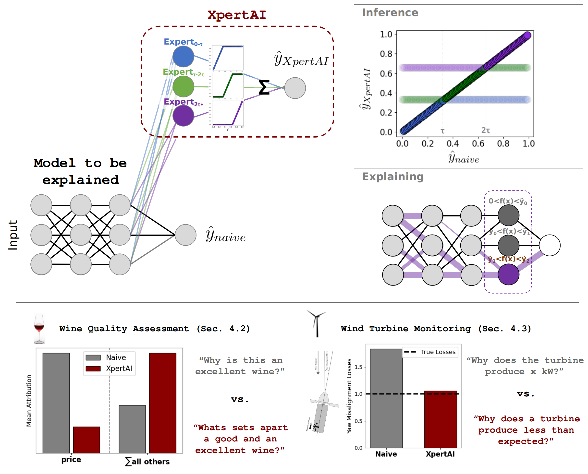

# XpertAI 🚀

Welcome to **XpertAI**! We believe that **explainable artificial intelligence (XAI)** is crucial for the informed application of machine learning methods in practice.



---

## 📰 News

🎉 Our paper **won the Best Paper Award** at the **2025 World Conference on eXplainable Artificial Intelligence**  
*(09–11 July, 2025 — Istanbul, Turkey)* 🎉

---

## 📖 About

This repository contains the **supplementary code** for our paper:  
["XpertAI: Uncovering Regression Model Strategies for Sub-manifolds"](https://link.springer.com/chapter/10.1007/978-3-032-08327-2_19#citeas)  

You’ll find:  
- A [**tutorial notebook**](./tutorial/XpertAI_tutorial.ipynb) demonstrating the **wine-quality prediction example** from the paper.  
- **Helper functions** in [`utils.py`](./tutorial/utils.py) to help you faithfully explain your own models.  

## Cite
In case you utilize the published code for your own paper, please cite us accordingly:

```bibtex
@incollection{Letzgus2026,
  author       = {Letzgus, S. and Müller, K. R. and Montavon, G.},
  title        = {XpertAI: Uncovering Regression Model Strategies for Sub-manifolds},
  booktitle    = {Explainable Artificial Intelligence. xAI 2025},
  editor       = {Guidotti, R. and Schmid, U. and Longo, L.},
  series       = {Communications in Computer and Information Science},
  volume       = {2578},
  publisher    = {Springer},
  address      = {Cham},
  year         = {2026},
  doi          = {10.1007/978-3-032-08327-2_19},
  url          = {https://doi.org/10.1007/978-3-032-08327-2_19}
}

